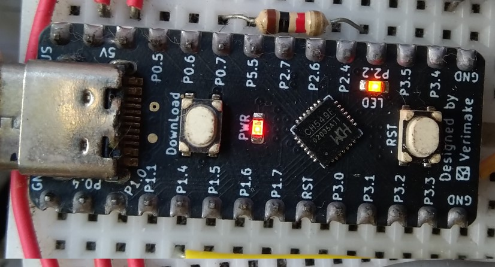
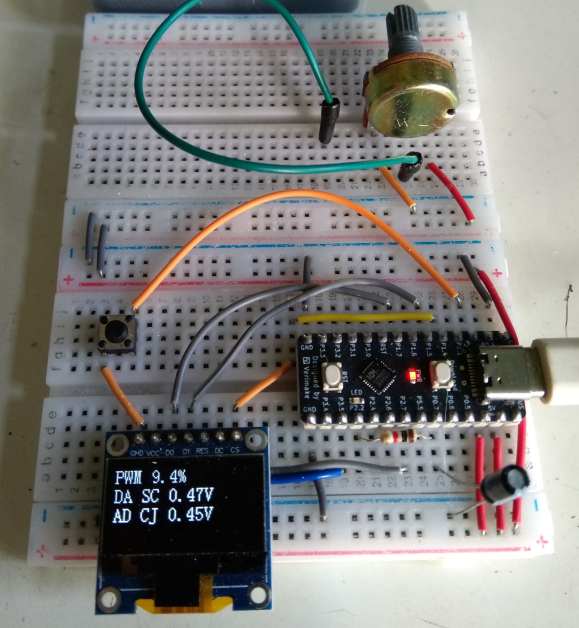
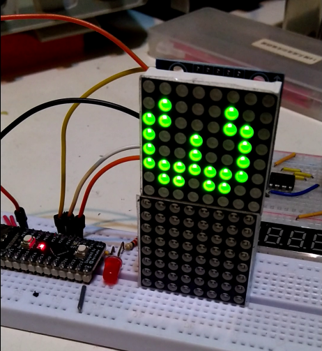

# 基於 Verimake WCH CH549 開發板的研究


<p align="left">
  
  
</p>


<p align="left">
  
  
  
</p>


## 為何建立這個倉庫
說來話長，雖然玩業餘無線電，對單片機一直興趣缺缺，郤因為一台 [FT-897 收發機的顯屏問題](https://www.hellocq.net/forum/read.php?tid=366165)，開始研究單片機。一切由零開始，自2020年中入門 Arduino Uno，玩了些點燈/Hello World，漸漸迷上了單片機。單片機的世界是這麼大，生活上許許多多的産品都離不開它的身影。作為一個業餘無線電愛好者，不去認識單片機似乎有點兒那過吧。

早前買過一台 [CW 練習器](https://www.hellocq.net/forum/read.php?tid=365793)，CW沒有練好，郤觸動我以這實體框架去研習單片機的編程。[該設備](/assets/cw_device.png) 採用 STM32F103CBT6 芯片，原設計有考慮作為 STM32 研發的用途。這樣一下子投進 STM32 世界，花了大半年時間，跌跌撞撞地摸索完成了 [myclock](https://github.com/VR2XHQ/myclock_keil) 固件在[它身上](assets/myclock.png)運行。

2022年中得到這塊小小的開發板，如今已經停産了。C51 架構雖然老舊，還是值得學習一下。依照 Verimake 提供的[導引](https://verimake.com/d/19-ch549-51)，我開始了這次旅程。板子配置 [WCH 沁恒](https://www.wch.cn) 的 [CH549](https://www.wch.cn/products/CH549.html) 芯片。編繹未跟官方採用 [Keil C51](https://developer.arm.com/documentation/101655/0961/?lang=en)，而以 [SDCC](https://sdcc.sourceforge.net) 來實現。最初我在 Windows 下搞，就因為 SDCC 在 Linux 下比較好用，於是又進了 Linux 的不歸之路。配以 Make 自動化操作，能夠輕鬆完成編繹及燒錄。當時因為 WCH 的燒錄工具對 Linux 支援不理想，燒寫固件便以 [wchisp](https://github.com/ch32-rs/wchisp) 為主。

Verimake 提供[例程範本](https://gitee.com/verimake/CH549)，它改編自 WCH 官方[閧發板](https://www.wch.cn/downloads/CH549EVT_ZIP.html)的資源。在依樣晝葫蔖的學習模式下，我嘗試改編及試作，完成了現時的模樣，都是些基本的東西，還欠 IAP, USBHostHUB_KM 等等尚未移植過來，一直擱置到現在了。

最近重新學習 git，於是順便整理一些舊工程項目作為練習，將它們放到 github 保存，記錄一下過往的研習.

## 倉庫的目錄結構
```text
sdcc_CH549/
├── assets/         圖片展示
├── doc/            參考資料
├── example/        範例程式
├── inc/            硬件驅動頭文件
├── Makefile        執行自動化文件
├── README.md       本說明文件
├── source/         硬件驅動原始文件
└── tools/          工具檔案
```

## 在 Linux Mint 架設開發環境
- 安裝 SDCC 編繹工具，依官方[文件](https://sdcc.sourceforge.net/doc/sdccman.pdf)，放到 /usr/local/bin。
- WCH 的頭文件袛適用於 Keil C51，因此要先做[轉換](https://csy-tvgo.github.io/Keil-C51-C-to-SDCC-C-Converter/)，生成適用於 SDCC 的[頭文件](tools/README_tools.md)。
- 安裝 GNU make。
- 下裁 [wchisp](https://github.com/ch32-rs/wchisp)，複製 Prebuilt binary 到 /usr/local/bin，並新建 [udev rules](tools/wchisp-linux-x64/README.md)。
- 下裁 WCH 官方的 [WCHISPTool_CMD](https://www.wch.cn/downloads/WCHISPTool_CMD_ZIP.html)，依[說明文件](tools/WCH-linux-x64/README.md)安裝。
- 工程根目錄下的簡單 [Makefile](./Makefile) 負責設定自動執行編繹及燒錄的流程，內容按需要自行調整配合。`make clean all` 就輕鬆重新編繹了。
- VScode 似乎無 SDCC 専屬的 extension, 但用它建立及修改代碼，在內建 Terminal 下做燒錄，仍是很方便的。


### 運行 demo_max7219 視頻 
<a href="assets/demo_video.mp4">
  
</a>


